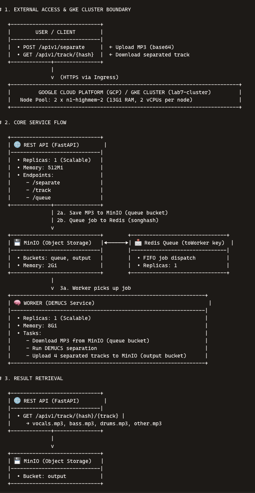
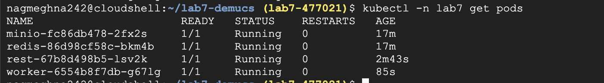
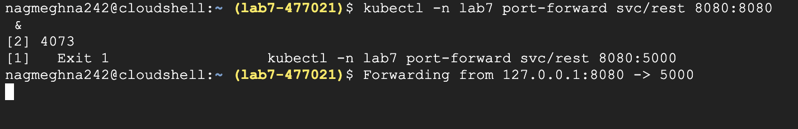
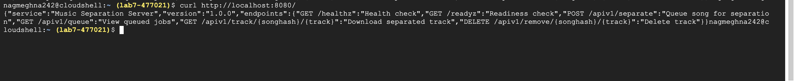
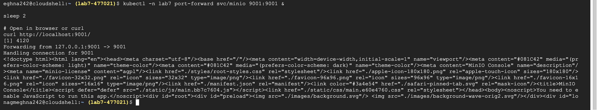
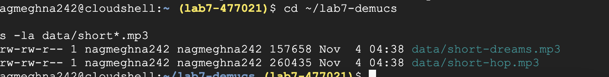
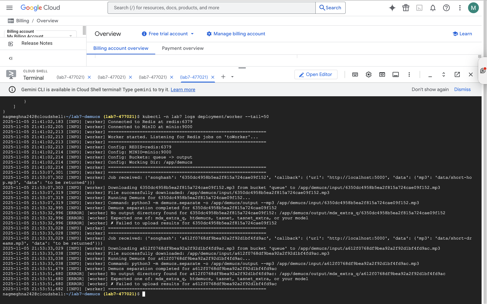
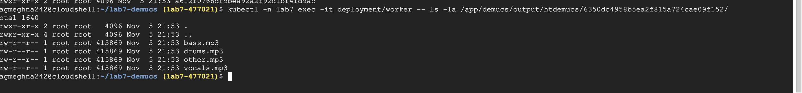
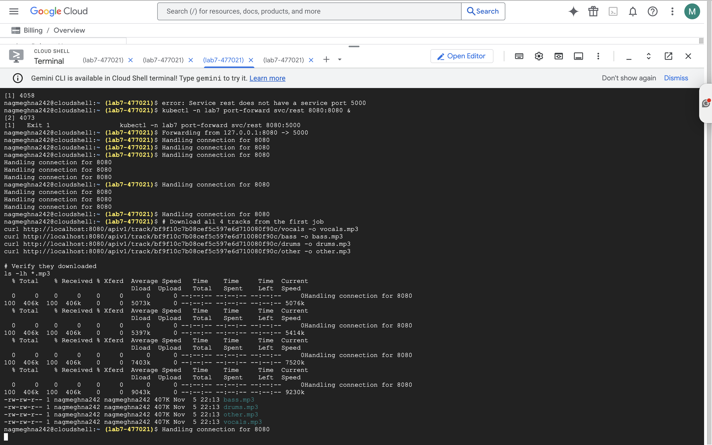

# Lab7 Music Separation

## Purpose
Built and deployed a music separation service on Google Cloud Kubernetes with REST API, DEMUCS worker, Redis queue, and MinIO storage.

---

## System Architecture


The system consists of 4 main components running on a GKE cluster:

- **REST API (FastAPI)**: Receives upload requests, queues jobs to Redis, serves downloads from MinIO
- **Worker (DEMUCS)**: Processes jobs from Redis queue, runs audio separation, uploads results to MinIO
- **Redis**: Job queue for coordination between REST API and Worker
- **MinIO**: Object storage for input MP3 files (queue bucket) and separated tracks (output bucket)

**Data Flow:**
1. User uploads MP3 → REST API stores in MinIO (queue bucket) → Job queued to Redis
2. Worker polls Redis → Downloads MP3 → Runs DEMUCS → Uploads results to MinIO (output bucket)
3. User downloads separated tracks → REST API fetches from MinIO → MP3 files delivered
   
---
## Commands & Outputs: 

### Setup GCP Project

```bash
gcloud services enable artifactregistry.googleapis.com
gcloud auth configure-docker us-central1-docker.pkg.dev --quiet
```

---
## Build and Push Docker Images

### Build REST API Image

```bash
docker build -t us-central1-docker.pkg.dev/lab7-477021/lab7/rest:v1 \
  -f rest/Dockerfile rest/
```

### Push REST API Image

```bash
docker push us-central1-docker.pkg.dev/lab7-477021/lab7/rest:v1
```

### Build Worker Image

```bash
docker build -t us-central1-docker.pkg.dev/lab7-477021/lab7/worker:v1 \
  -f worker/Dockerfile worker/
```

### Push Worker Image

```bash
docker push us-central1-docker.pkg.dev/lab7-477021/lab7/worker:v1
```

---

## Deploy Services to Kubernetes

### Create Redis Service

```bash
kubectl apply -f redis/redis-deployment.yaml
kubectl apply -f redis/redis-service.yaml

kubectl -n lab7 wait --for=condition=ready pod -l app=redis --timeout=60s
```

### Create MinIO Service

```bash
kubectl apply -f minio/minio-secret.yaml
kubectl apply -f minio/minio-deployment.yaml
kubectl apply -f minio/minio-service.yaml

kubectl -n lab7 wait --for=condition=ready pod -l app=minio --timeout=120s
```

### Create REST API Service

```bash
kubectl apply -f rest/rest-deployment.yaml
kubectl apply -f rest/rest-service.yaml

kubectl -n lab7 wait --for=condition=ready pod -l app=rest --timeout=120s
```

### Create Worker Service

```bash
kubectl apply -f worker/worker-deployment.yaml

kubectl -n lab7 wait --for=condition=ready pod -l app=worker --timeout=120s
```

### Verify All Services Running



```bash
kubectl -n lab7 get pods
```

---

### Port Forward REST API





```bash
kubectl -n lab7 port-forward svc/rest 8080:8080 &
```

### Test REST API Health


```bash
curl http://localhost:8080/
```

### Port Forward MinIO & Test MinIO



```bash
kubectl -n lab7 port-forward svc/minio 9001:9001 &
```

```bash
curl http://localhost:9001/
```

### Run Sample Test Script



```bash
export REST=localhost:8080

python3 short-sample-request.py
```

### Check Worker Logs



```bash
kubectl -n lab7 logs deployment/worker --tail=50
```

### Check Worker's List Files in Output Directory


```bash
kubectl -n lab7 exec -it deployment/worker -- ls -la /app/demucs/output/htdemucs/
```

### List Files in Specific Song Directory



```bash
kubectl -n lab7 exec -it deployment/worker -- ls -la /app/demucs/output/htdemucs/6350dc4958b5ea2f815a724cae09f152/
```

### Download Separated Tracks & Verify Downloaded Files



```bash
ls -lh *.mp3

file vocals.mp3
```

### Create Results Folder

```bash
mkdir -p results

mv vocals.mp3 bass.mp3 drums.mp3 other.mp3 results/
```

### Check Git Status

```bash
git status
```

### Add Results to Git

```bash
git add results/

git commit -m "Add separated music tracks from DEMUCS processing"

git push origin main --force
```
